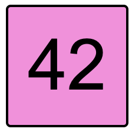
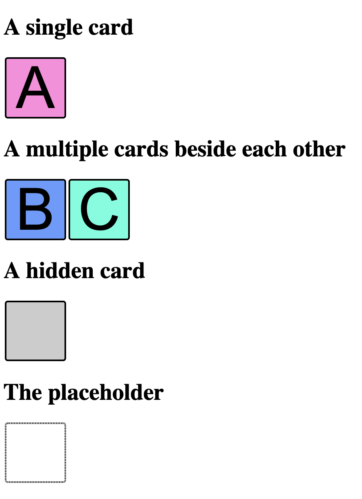

# 4. First Html

## Sources

- [Html](https://package.elm-lang.org/packages/elm/html/latest/)
- [Html docs](https://package.elm-lang.org/packages/elm/html/latest/Html)
- [Html.Attributes docs](https://package.elm-lang.org/packages/elm/html/latest/Html-Attributes)

## DIY

The goal is to implement a function that renders the Html for a memory card. See the image below as an example:  

> Note we are going to do this with inline CSS for simplicity. Of course there are other/better ways to do this. For example, including a style sheet or a more Elm-like solution using [elm-css](https://github.com/rtfeldman/elm-css).

The simplest way to start this process is to use `elm reactor`, this will start a simple web server that will recompile your code on a refresh.
The main building block for the cards are prepared, for you the task to assemble the functions in such a way that the correct HTML is rendered.
Follow along the `TODO`s in the `src/Card.elm`.

The output should look something like this:  

## What you should know afterwards

- How Html is structured in the language;
- How to refactor/reuse Html;
- How to write imports;
- What the entry point for an elm application is.
